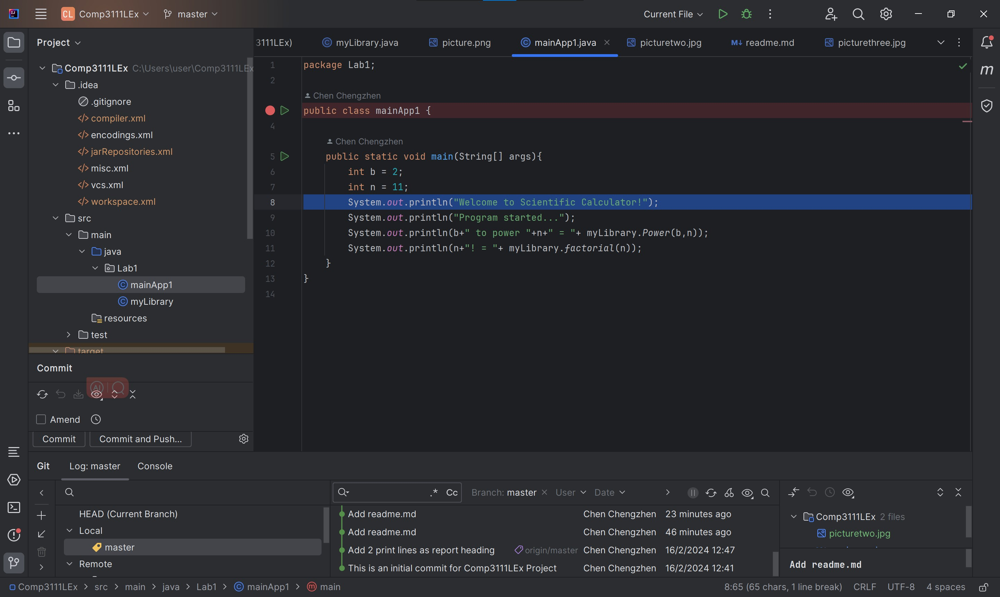

# Markdown

This is nmy first lab in Comp3111 - Software Engineering

    1. I have learnt the way to build a Java Project in intellij;
    2. I have successfully created my first GitHub to share project source with others;

Here's the screenshot of my 1st lab project in intellij:
